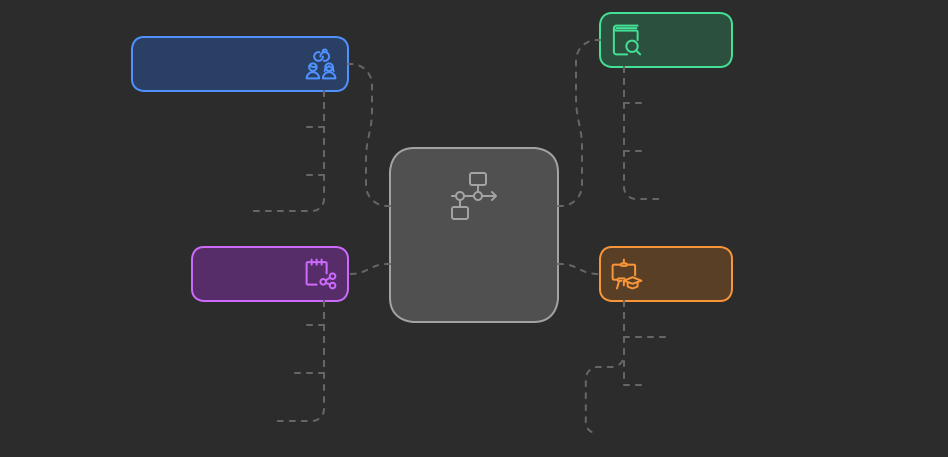

# Consideraciones de diseño del curso 

## Consideraciones iniciales

Estas consideraciones se proponen a partir de las reuniones iniciales con el grupo 
de profesores que dirigen los programas de la Escuela de Administración, 
Economía y Negocios:

* El curso tendrá una duración de 50 horas.
* El curso se compone de 4 sesiones presenciales, cada una de 4 horas, y 
  34 horas de trabajo independiente. 
* Se acerca la renovación del registro calificado de algunos programas. 
  También, posibles transformaciones curriculares.
* Se ve necesario articular el currículo con los avances tecnológicos.
* Se reconoce una brecha entre el currículo y lo que realmente ocurre en las 
  empresas.
* Se identifica la necesidad de actualizar a los profesores en el uso 
  de herramientas y procesos que están alineados con el día a día de las 
  empresas.
* Se considera necesario introducir herramientas basadas en inteligencia 
  artificial en los cursos.
* Se considera que el diseño y implementación de este curso será exitoso 
  si sirve de insumo para el diseño de experiencias de aprendizaje en 
  los cursos de los programas.
* Se busca que el curso permita a los asistentes acercarse a los fundamentos 
  que permitan seleccionar de manera informada herramientas.
* Se desea incorporar en los cursos herramientas que soporten el análisis de 
  datos y la toma de decisiones.

## Objetivos del curso 

Proponemos tres objetivos fundamentales para el curso:

1. Objetivo del curso: desarrollar la capacidad de diseñar, implementar y evaluar    
   experiencias de aprendizaje contextualizadas, que integren herramientas de inteligencia artificial, para abordar problemas de análisis de datos, automatización de procesos, la toma de decisiones y/o las necesidades que determine el profesor en su curso. 

2. Objetivo de análisis crítico de pertinencia: fomentar en los profesores la capacidad de analizar 
   críticamente si las experiencias de aprendizaje que diseñan ofrecen a los estudiantes oportunidades para desarrollar competencias relevantes y alineadas con la realidad y las tendencias actuales del mundo de los negocios, asegurando que el aprendizaje sea significativo y actualizado.

3. Objetivo de sistematización: sistematizar las experiencias de aprendizaje creadas por los 
   profesores en un repositorio estructurado, con el propósito de compartir prácticas y recursos innovadores que enriquezcan la comunidad educativa.

## Competencias, criterios y niveles esperados

### Competencia de diseño e implementación

Competencia: diseña, implementa y evalúa experiencias de aprendizaje contextualizadas que integren herramientas de inteligencia artificial para abordar problemas de análisis de datos, automatización de procesos, la toma de 
decisiones y/o las necesidades específicas del curso.

Criterios de competencia:

Analizo problemas de análisis de datos, automatización y toma de decisiones en el contexto de un curso, proponiendo soluciones basadas en IA. (Nivel: autónomo)

Diseño experiencias de aprendizaje que integran herramientas de IA, asegurando que sean significativas y aplicables al contexto del curso (Nivel: autónomo).

### Competencia de análisis crítico

Competencia: analiza críticamente las experiencias de aprendizaje diseñadas, asegurando que ofrezcan oportunidades relevantes y alineadas con las tendencias actuales del mundo de los negocios, para un aprendizaje significativo y actualizado.

Criterios de Competencia:

Analizo las experiencias de aprendizaje para determinar su relevancia y alineación con las tendencias del entorno empresarial, aplicando estrategias avanzadas de evaluación (Nivel: estratégico).

Propongo mejoras basadas en un análisis crítico, asegurando que las experiencias sean actualizadas y significativas (Nivel: autónomo).

### Competencia de Sistematización

Competencia: sistematiza las experiencias de aprendizaje creadas en un repositorio estructurado, facilitando el intercambio de prácticas y recursos innovadores con la comunidad educativa.

Criterios de Competencia:

Sistematizo mis experiencias educativas, organizando los recursos y materiales de manera coherente y estructurada (Nivel: autónomo).

Desarrollo un repositorio que sea accesible y útil para otros educadores, asegurando la calidad y claridad de la información compartida (Nivel: estratégico).

## Análisis de los niveles de los criterios propuestos

### Competencia de diseño e implementación

Criterio: analizo problemas de análisis de datos, automatización y toma de decisiones en el contexto de un curso, proponiendo soluciones basadas en IA. (Nivel: autónomo)

Razonamiento: se elige el nivel autónomo porque se espera que los profesores no solo comprendan los problemas, sino que sean capaces de analizar y proponer soluciones de forma independiente y con criterio propio. Evaluar este criterio a un nivel resolutivo sería insuficiente, ya que solo implicaría aplicar soluciones estándar sin un análisis profundo. En cambio, un nivel estratégico podría ser demasiado exigente, dado el tiempo limitado y la necesidad de mostrar innovación y planificación avanzada.

Criterio: diseño experiencias de aprendizaje que integran de manera efectiva herramientas de IA, asegurando que sean significativas y aplicables al contexto del curso. (Nivel: autónomo)

Razonamiento: este nivel implica que el profesor puede diseñar de manera independiente, asegurando que las experiencias se adapten a las necesidades de su contexto específico. Se elige un nivel autónomo porque se espera que los profesores desarrollen un diseño sólido y justificado. Un nivel resolutivo sería demasiado básico, mientras que un nivel estratégico podría requerir una planificación más avanzada e innovación que quizás no sea factible dentro del marco del curso.

### Competencia de Análisis Crítico

Criterio: analizo las experiencias de aprendizaje para determinar su relevancia y alineación con las tendencias del entorno empresarial. (Nivel: estratégico)

Razonamiento: se elige un nivel estratégico porque este criterio implica un análisis profundo y la capacidad de aplicar estrategias de evaluación en contextos complejos. Aquí, el profesor debe demostrar no solo un entendimiento crítico, sino también la capacidad de evaluar cómo las experiencias se alinean con tendencias emergentes. Un nivel autónomo sería insuficiente para captar la complejidad de este análisis.

Criterio: propongo mejoras basadas en un análisis crítico, asegurando que las experiencias sean actualizadas y significativas. (Nivel: autónomo)

Razonamiento: se elige un nivel autónomo porque se espera que los profesores puedan sugerir mejoras de manera independiente y fundamentada, pero sin la necesidad de desarrollar estrategias avanzadas o completamente innovadoras, como lo requeriría un nivel estratégico. Un nivel resolutivo no sería adecuado, ya que solo implicaría hacer cambios sencillos sin una justificación crítica.

### Competencia de Sistematización

Criterio: Sistematizo mis experiencias educativas, organizando los recursos y materiales de manera coherente y estructurada. (Nivel: autónomo)

Razonamiento: se elige un nivel autónomo porque los profesores deben ser capaces de organizar y sistematizar su trabajo de forma independiente y coherente. Este nivel es apropiado para el desarrollo de un repositorio que sea útil y accesible. Un nivel resolutivo sería demasiado básico y no captaría la complejidad de organizar materiales de manera efectiva, mientras que un nivel estratégico podría requerir elementos avanzados de planificación y diseño que no sean factibles en el marco del curso.

Criterio: desarrollo un repositorio que sea accesible y útil para otros educadores, asegurando la calidad y claridad de la información compartida. (Nivel: estratégico)

Razonamiento: este criterio requiere un nivel estratégico porque implica crear un recurso que no solo cumpla con estándares básicos, sino que también sea innovador y altamente funcional para la comunidad educativa. Aquí, se necesita una planificación avanzada para garantizar que el repositorio sea efectivo. Un nivel autónomo no captaría la necesidad de asegurar calidad y accesibilidad a un nivel elevado.

## Evidencias de aprendizaje

El curso se estructurará utilizando micro challenges (personalizados a cada profesor), alineados 
con las tres fases del marco Challenge Based Learning (CBL): Engagement (Compromiso), Investigation (Investigación) y Action (Acción). Cada fase incluirá actividades específicas para asegurar que los profesores logren los objetivos del curso.

Se esperan estos productos durante el curso:

1. Planteamiento del desafío: una definición clara y justificada del desafío que abordará cada 
   profesor durante el curso. Es de aclarar que esto se refiere al curso para preparar la 
   experiencia, no a la experiencia misma que diseñará el profesor para sus estudiantes, 
   es decir, el profesor podría decidir diseñar la experiencia para sus estudiantes como 
   un RETO o definir otra estrategia que considere más pertinente para el contexto 
   de su curso.

2. Diseño de la experiencia de aprendizaje: un esquema detallado de la experiencia, con actividades 
   clave y recursos pedagógicos alineados con las competencias identificadas.

3. Material didáctico completo: todos los recursos y materiales necesarios para implementar la 
   experiencia en el curso.

4. Métricas de éxito: un conjunto de criterios y herramientas de evaluación para medir el éxito de la 
   experiencia de aprendizaje.

5. Plan de recolección de evidencias: un plan detallado para recopilar evidencias necesarias para 
   evaluar el éxito de la experiencia.

6. Documentación sistematizada: la experiencia de aprendizaje completamente documentada y preparada 
   para su inclusión en el repositorio comunitario.

## Estructura

### Engage (Comprometerse)

Propósito: motivar (aunque esto es un compromiso compartido) a los profesores y ayudarlos a identificar un desafío educativo significativo y contextualizado, relacionado con el desarrollo de competencias utilizando herramientas como la inteligencia artificial y la automatización. Esta fase busca que los profesores reflexionen sobre las necesidades de sus estudiantes y el contexto de sus cursos, y formulen un desafío claro que puedan abordar. Se busca conectar el desafío con las tendencias actuales del mundo empresarial y educativo para asegurar su relevancia.

Actividades y evidencias: sesión 1.

### Investigate (Indagar)

Propósito: facilitar un proceso de investigación donde los profesores profundicen en el desafío identificado, explorando tanto teorías educativas como tecnologías disponibles. En esta fase, los profesores recopilan información, investigan soluciones existentes, analizan casos de estudio y reflexionan sobre las mejores prácticas. El objetivo es que comprendan el problema en profundidad y generen ideas informadas para el diseño de una solución. Esto incluye analizar cómo la inteligencia artificial y la automatización pueden integrarse en experiencias de aprendizaje efectivas.

Actividades y evidencias: sesiones 2 y 3.

### Act (Actuar)

Propósito: diseñar una experiencia de aprendizaje completa que integre las herramientas y conceptos investigados. En esta fase, los profesores desarrollan la planeación detallada, el material didáctico, las métricas de evaluación y el plan de recolección de evidencias. Aunque la implementación real se pospondrá para el semestre siguiente, el diseño debe ser lo suficientemente robusto y detallado para que pueda llevarse a cabo y evaluarse de manera efectiva. Se proporciona espacio para asegurar que el diseño esté alineado con las competencias esperadas y listo para su futura implementación.

Actividades y evidencias: sesiones 3 y 4.

### Share (Compartir)

Propósito: al final de todo el proceso, después de que los profesores hayan implementado la experiencia de aprendizaje, recolectado evidencia y evaluado los resultados, esta fase sirve para compartir sus hallazgos y resultados con la comunidad educativa. Los profesores presentan el impacto de sus experiencias, discuten los aprendizajes y desafíos encontrados, y comparten las evidencias recolectadas. El propósito es promover la reflexión colectiva, el intercambio de buenas prácticas y el enriquecimiento mutuo a través de la socialización de las soluciones diseñadas y sus efectos.

Evidencia: repositorio comunitario.

## Cronograma

El curso tiene una duración de 50 horas con 5 sesiones presenciales distribuidas de la siguiente forma:

### Sesión 1: compromiso

**Duración:** 12 horas. 4 presenciales - 8 independientes.

**Macro Actividades presenciales**

- Presentación del curso, su metodología y herramientas de soporte.
- Exploración de conceptos claves.
- Exploración de posibles problemas.
- Formulación de preguntas esenciales.
- Socialización de los avances de la sesión 1.

**Macro Actividades independientes**

- Profundizar en la refinación del problema.
- Identificación, descripción y justificación del problema a abordar en la experiencia
  de aprendizaje del curso.
- Elaborar preguntas guía e inicio de la búsqueda de los recursos guía (tutoriales, 
  herramientas, casos de estudio, etc).

**Resultado esperado:** 

Identificación y descripción de un problema a abordar en uno de los cursos. Este problema estará alineado 
con los resultados de aprendizaje y será pertinente para el contexto de actuación del programa académico particular. 
El problema será abordado con herramientas tecnológicas emergentes: inteligencia artificial, automatización de 
tareas, entre otras.

### Sesión 2: indagación

**Duración:** 12 horas. 4 presenciales - 8 independientes.

**Macro Actividades presenciales**

- Socialización y realimentación de la sesión 1.
- Aprendizaje robusto.
- Exploración colectiva de herramientas.
- Socialización de los avances de la sesión 2.

**Macro Actividades independientes**

- Continuar el proceso de indagación.
- Síntesis.
- Diseño preliminar de la experiencia de aprendizaje.

**Resultado esperado:** 

- Síntesis del proceso de indagación.
- Diseño de la experiencia de aprendizaje para uno de los cursos que acompañará en 2025-10 a partir de la identificación 
  del problema que será abordado, incluyendo: 

    - Planeación detallada de la experiencia de aprendizaje (paso a paso).
    - Actividades clave y recursos pedagógicos alineados con los resultados de aprendizaje planeadas.

### Sesión 3: actuar

**Duración:** 12 horas. 4 presenciales - 8 independientes.

**Macro Actividades presenciales**

- Socialización y realimentación de la sesión 2.
- Construcción de material didáctico.
- Socialización de los avances de la sesión 3.

**Macro Actividades independientes**

- Construcción del material didáctico.
- Plan de recolección de evidencias para la medición del éxito de la 
  experiencia de aprendizaje.
- Revisión y ajustes al diseño de la experiencia de aprendizaje.

**Resultado esperado:** 

Construcción del material didáctico, plan de medición de la experiencia y ajuste final.

### Sesión 4: actuar-compartir

**Duración:** 12 horas. 2 presenciales - 10 independientes.

**Macro Actividades presenciales**

- Socialización y realimentación de la sesión 3.
- Actividad de cierre de 2024-20.

**Macro Actividades independientes**

- Despliegue de la experiencia de aprendizaje en 2025-10
- Recolección de evidencias
- Análisis, reflexiones y posibles mejoras.
- Ajuste a la experiencia de aprendizaje en el repositorio comunitario.

**Resultado esperado:** 

Despliegue de la experiencia en el aula, recolección de evidencias para 
el análisis y propuesta de ajuste y montaje de la experiencia 
en el repositorio comunitario.

### Sesión 5: compartir

**Duración:** 2 horas. 2 presenciales. 

**Macro Actividades presenciales**

- Socialización y realimentación de la sesión 4.
- Actividad de cierre del curso.
